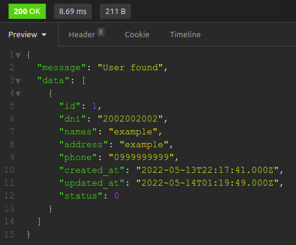

# Node Express Project ApiUsers

Computer Version:

[](https://www.microsoft.com/es-es/windows/windows-11?r=1)
[](https://ubuntu.com/)
[](https://www.apple.com/la/mac/)

> <strong> Project of a restful api to register the data of a user, we use node - express - typescript - mysql. </strong> > 

[](https://expressjs.com/es/)
[](https://www.typescriptlang.org/)
[](https://www.javascript.com/)
[](https://www.npmjs.com/)
[](https://nodejs.org/es/)
[](https://www.mysql.com/)
[](https://github.com/)
[](https://git-scm.com/)
[](https://www.linux.org/)
[](https://www.microsoft.com/es-es/windows/windows-11?r=1)
[](https://code.visualstudio.com/)

## 💻 Pre requirements


To use the project on your machine, you must have the following installed:

- Have the mysql service installed or a local server that has the service.
- Have installed nodejs higher than v14 and MySQL higher than 5.7.

## 🌐 Database <ts_apiusers>


Before starting the project <ts_apiusers>, you must follow these steps:

1. Create an .env at the root of the project.
2. In the .env file add the execution port of the project and the mysql credentials:
   ```
   PORT=9000
   DB_HOST=localhost
   DB_DATABASE=ts_api_users
   DB_USER=root
   DB_PASSWORD=root
   ```
3. Copy the database script found in path, to your mysql engine:
   > db/script.sql

## 📥 Requirements <ts_apiusers>


To start the project <ts_apiusers>, you must follow the following steps:

1. Open a terminal at the root of the project.
2. In the main root of the project execute the following in your terminal:
   ```
   npm install
   ```

## 🚀 Start project <ts_apiusers>

To start the project <ts_apiusers>, you must follow the following steps:

- Open a terminal at the root of the project.
- Run the following command:
  ```
  npm run test
  ```
- Open in your browser or run in an API test program:
  - {GET} = [http:/127.0.0.1:9000/api/users/](http://127.0.0.1:9000/api/users/)
  - {GET/ID} = [http:/127.0.0.1:9000/api/users/](http://127.0.0.1:9000/api/users/)
  - {POST} = [http:/127.0.0.1:9000/api/users/](http://127.0.0.1:9000/api/users/)
  - {PUT/ID} = [http:/127.0.0.1:9000/api/users/](http://127.0.0.1:9000/api/users/)
  - {DELETE/ID} = [http:/127.0.0.1:9000/api/users/](http://127.0.0.1:9000/api/users/)

<div align="center">

### 👤 My social accounts 🇪🇨


[](https://twitter.com/harlericho)
[](https://github.com/harlericho)
[](https://hub.docker.com/u/harlericho)
[](https://harlericho.netlify.app)

</div>
